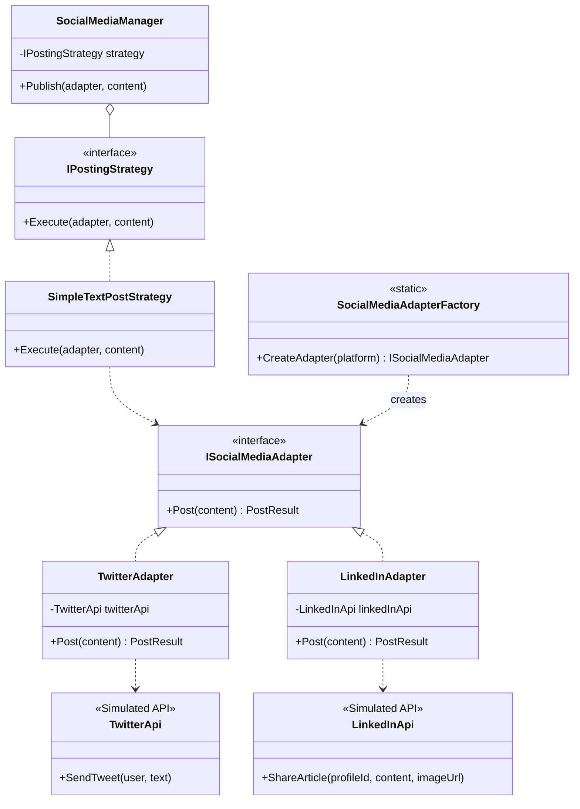

# Social Media API Integration with Design Patterns

 

A proof-of-concept project in C# demonstrating how to build a flexible and scalable system for integrating multiple social media APIs. This system leverages key software design patterns to manage complexity and promote clean code.

## 🎯 Project Goal

The main objective is to create a unified system for posting content to heterogeneous social media platforms (like Twitter and LinkedIn). Each platform has its own unique API, data models, and methods. This project demonstrates how to abstract this complexity away from the client using the following design patterns:

- **Adapter Pattern:** To unify different third-party API interfaces.
- **Factory Method Pattern:** To decouple the client from the concrete implementation of the adapters.
- **Strategy Pattern:** To allow the publishing algorithm or behavior to be changed at runtime.

## ✨ Core Concepts Demonstrated

### 1. Adapter Pattern
The core of the solution. It wraps the specific, incompatible APIs (e.g., `TwitterApi`, `LinkedInApi`) into a common, unified interface (`ISocialMediaAdapter`). This allows our main application (`SocialMediaManager`) to interact with any social media platform in the same way, without needing to know the specific details of each one.

### 2. Factory Method Pattern
The `SocialMediaAdapterFactory` is responsible for creating the correct adapter instance based on a configuration string (e.g., `"twitter"`). This decouples the client from the instantiation process, making it easy to add new platforms without changing the client's code, adhering to the Open/Closed Principle.

### 3. Strategy Pattern
The `IPostingStrategy` interface allows us to define different algorithms for publishing content. For example, a `SimpleTextPostStrategy` might just publish text, while a future `ValidatedImagePostStrategy` could perform checks on the image before posting. The `SocialMediaManager` uses a strategy to execute the post, allowing this behavior to be easily swapped.

## 🏛️ System Architecture

The project is structured to separate concerns, making it clean and easy to navigate. The diagram below illustrates the relationship between the main components.



## 🛠️ Tech Stack
- **Language:** C#
- **Framework:** .NET 8

## 🚀 Getting Started

Follow these instructions to get the project up and running on your local machine.

### Prerequisites
- [.NET 8 SDK](https://dotnet.microsoft.com/download/dotnet/8.0) or later.
- [Git](https://git-scm.com/).

### Installation & Execution

1.  **Clone the repository:**
    ```sh
    git clone [https://github.com/seu-usuario/social-media-api-adapter.git](https://github.com/seu-usuario/social-media-api-adapter.git)
    ```
    *(Lembre-se de substituir `seu-usuario` e `social-media-api-adapter` pelo seu usuário e nome de repositório real)*

2.  **Navigate to the project directory:**
    ```sh
    cd social-media-api-adapter
    ```

3.  **Run the application:**
    ```sh
    dotnet run
    ```

The console output will show the process of posting to each configured platform using the appropriate adapter.

### Example Usage (`Program.cs`)
The main entry point demonstrates how all the pieces work together:
```csharp
// --- CONFIGURATION ---
var platformsToPost = new[] { "twitter", "linkedin" };

// --- CONTENT CREATION ---
var myContent = new Content
{
    Author = "MarketingAgency",
    Text = "Check out our new campaign!",
    ImageUrl = "[http://example.com/image.png](http://example.com/image.png)"
};

// --- MANAGER INITIALIZATION ---
var manager = new SocialMediaManager(new SimpleTextPostStrategy());

foreach (var platform in platformsToPost)
{
    // 1. FACTORY: Creates the correct adapter dynamically
    var adapter = SocialMediaAdapterFactory.CreateAdapter(platform);

    // 2. STRATEGY & ADAPTER: The manager uses the strategy to publish
    var result = manager.Publish(adapter, myContent);

    // 3. UNIFIED RESPONSE: The result is displayed
    Console.WriteLine($"Result for {platform}: {result.Message}");
}
```

## 🧩 How to Extend the System

Adding a new social media platform (e.g., TikTok) is straightforward thanks to the design:

1.  **Create a Simulated API:**
    - Create a new class `TikTokApi.cs` in the `SimulatedApis` folder with its own specific methods.
2.  **Create a New Adapter:**
    - Create `TikTokAdapter.cs` in the `Adapters` folder.
    - Implement the `ISocialMediaAdapter` interface, translating the unified `Post` call to the specific methods of your `TikTokApi`.
3.  **Update the Factory:**
    - Add a new case in `SocialMediaAdapterFactory.cs`:
      ```csharp
      public static ISocialMediaAdapter CreateAdapter(string platform)
      {
          return platform.ToLower() switch
          {
              "twitter" => new TwitterAdapter(),
              "linkedin" => new LinkedInAdapter(),
              "tiktok" => new TikTokAdapter(), // Add this line
              _ => throw new NotSupportedException(...)
          };
      }
      ```
4.  **Done!** No other part of the system needs to be changed.

##
